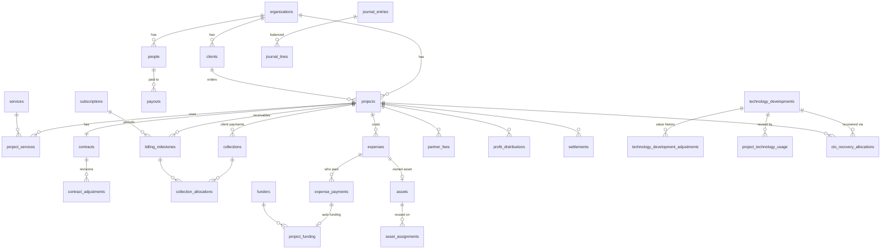

# Move Beyond Company OS — Architecture

Finance is **module #1**, not the architecture. Everything below is shared by
future modules (CRM, Sales, Operations, HR, Inventory, Client Portal…).

## 1. Platform

```text
Browser ──► Next.js 16 (App Router, Vercel)
              │  proxy.ts        session refresh + signed-out redirect (optimistic only)
              │  Server pages    read views via Supabase (user JWT → RLS applies)
              │  Server actions  call mb_* RPCs (user JWT → permission checks in SQL)
              ▼
           Supabase Postgres (eu-west-1)
              ├─ RLS on every tenant table (organization_id)
              ├─ SECURITY DEFINER mb_* RPCs  = the only way money moves
              ├─ Double-entry ledger (journal_entries / journal_lines)
              ├─ Reporting views (security_invoker)  = the only source of numbers
              ├─ Audit trigger on every business table
              └─ pg_cron: daily mb_refresh_alerts
           Supabase Storage (private "documents" bucket)
           Resend (email channel for high-priority alerts)
```

| Layer | Location | Rule |
|---|---|---|
| Routes | `src/app/(shell)/…` | Thin: fetch via `src/services`, render components |
| Read layer | `src/services/queries.ts` | Reads views; derives metrics through engines only |
| Engines | `src/engines/*` | Pure TS, fully unit-tested, no I/O |
| Actions | `src/app/actions/*` | One RPC per money action, idempotency key passed through |
| UI kit | `src/components/ui/*` | Design tokens in `globals.css` (light, neutral — D12) |
| Finance UI | `src/components/finance/*` | Forms and tables shared across pages |
| Database | `supabase/migrations/000N_*.sql` | Numbered, applied once by `npm run db:migrate` |

## 2. Master records (spec §3)

One table each, shared by every module: `organizations`, `people`, `clients`,
`contacts`, `services` (+`service_categories`), `suppliers`, `projects`,
`assets`, `documents`, `technology_developments`. Future modules add their own
tables that **reference these IDs** — never `crm_clients`, `finance_clients`.

## 3. ERD (core)



## 4. Ledger model (spec §98)

Users never see debit/credit. Every RPC writes one **balanced** entry
(deferred constraint: Σ lines = 0, ≥ 2 lines). Lines carry dimensions:
`project_id`, `person_id`, `cash_account_id`, `category_id`.

| Account | Type | Meaning |
|---|---|---|
| CASH | asset | Money; `cash_account_id` = Company Bank or *Held by partner X* (D2) |
| FIXED_ASSETS | asset | Only capitalised purchases (E5) |
| DUE_FUNDING / DUE_EMPLOYEE / DUE_FEE / DUE_CTO / DUE_PROFIT / DUE_CARRY | liability | What the company owes each person, **by category** |
| PARTNER_CAPITAL | equity | Reinvested profit, non-reimbursable contributions |
| OPENING_EQUITY | equity | Go-live balances |
| DISTRIBUTIONS | equity | Profit distributed / loss allocated, by project & person |
| REVENUE | revenue | Cash basis (D1) |
| DIRECT_COST / PARTNER_FEE_COST / CTO_RECOVERY_COST | expense | Project P&L lines |
| OVERHEAD | expense | Company overhead, bank adjustments |

Posted lines are immutable. Edit = reverse + repost with reason. Delete =
reversal + `deleted_at` (+ Deleted Records view).

### Postings

| Action | Debit | Credit |
|---|---|---|
| Client payment | CASH (bank / held) | REVENUE |
| Company pays cost | DIRECT_COST / OVERHEAD | CASH |
| Partner pays cost (reimbursable) | DIRECT_COST | DUE_FUNDING(person) |
| Partner pays (not reimbursable) | DIRECT_COST | PARTNER_CAPITAL(person) |
| Employee pays cost | DIRECT_COST | DUE_EMPLOYEE(person) |
| Cash funding | CASH | DUE_FUNDING(person) |
| Fee accepted (project cost / from share) | PARTNER_FEE_COST / DISTRIBUTIONS | DUE_FEE |
| CTO recovery allocated | CTO_RECOVERY_COST / DISTRIBUTIONS | DUE_CTO |
| Profit distribution | DISTRIBUTIONS | DUE_PROFIT + PARTNER_CAPITAL (reinvested) |
| Loss allocated to partner | DUE_CARRY | DISTRIBUTIONS |
| Any payout | DUE_x(person) | CASH |
| Move Beyond funding recovered | — memo only (E3) — | |
| Opening balance | CASH or OPENING_EQUITY | OPENING_EQUITY or DUE_x |

## 5. CTO recovery architecture (spec §44–62)

* `technology_developments` — the reusable system, developer, ownership, lifecycle.
* `technology_development_adjustments` — initial value + extensions/reductions.
  **Approved value = Σ adjustments** (history never overwritten).
* `cto_recovery_allocations` — exact amounts per project (or `opening` for
  pre-go-live). **Recovered = Σ live allocations. Outstanding = value − recovered.**
* `project_technology_usage` — which projects reuse which system + decision
  (`pending`, `add_recovery`, `decide_at_settlement`, `no_recovery`) + planned amount.
* Hard cap: `mb_allocate_cto_recovery_internal` locks the technology row
  (`FOR UPDATE`) and rejects `amount > outstanding` with
  *“Maximum remaining recovery is X EGP.”*
* Eligibility is a flag on `people.technology_recovery_eligible`, never a name.
* Ledger source types: `cto_recovery_allocated`, `payout_cto`; audit actions
  `cto_development_created`, `cto_development_adjusted`, `cto_recovery_reversed`.

## 6. Permissions matrix (spec §89–90)

| Permission | Partner | CTO (additive) | Admin | Finance | Project / Event manager |
|---|:-:|:-:|:-:|:-:|:-:|
| Everything (`*`) | ✓ | | ✓ | | |
| finance.view / manage | ✓ | | ✓ | ✓ | |
| partners.view | ✓ | | ✓ | ✓ | |
| partners.distribute | ✓ | | ✓ | | |
| settlements.manage | ✓ | | ✓ | ✓ | |
| technology.view / manage / recover | ✓ | ✓ | ✓ | view, recover | |
| projects.view_all / manage / close | ✓ | | ✓ | ✓ | |
| projects.reopen | ✓ | | ✓ | | |
| projects.view_assigned | ✓ | | ✓ | | ✓ |
| expenses.create_assigned, suppliers.create | ✓ | | ✓ | ✓ | ✓ |
| settings / users / people / audit | ✓ | | ✓ | audit | |

Project managers see only assigned projects (Overview, Expenses, Documents) and
never company balances, partner accounts or distributions (RLS-tested).

## 7. Route map

| Route | Purpose |
|---|---|
| `/finance` | Finance Home (§79) — KPIs, quick actions, alert center |
| `/finance/projects`, `/new`, `/[id]?tab=` | Project list, creation, 10-tab finance page (§82) |
| `/finance/clients`, `/[id]` | Client master |
| `/finance/collections` | Ageing + due windows (§34) |
| `/finance/revenue` | Monthly company P&L + collections log |
| `/finance/expenses`, `/commitments` | All costs; unpaid commitments |
| `/finance/settlements` | Projects ready to settle + history |
| `/finance/partners`, `/[id]` | Partner accounts & statements (§58, §78) |
| `/finance/cto`, `/[id]` | CTO dashboard & recovery statement (§57, §93) |
| `/finance/subscriptions` | MRR, ARR, renewals (§36) |
| `/finance/suppliers`, `/[id]` | Supplier master & statement |
| `/finance/assets` | Asset register & availability (§70–73) |
| `/finance/bank` | Balances, transactions, transfers, adjustments, opening balances |
| `/finance/reserve` | Reserve vs target (§66) |
| `/finance/forecast` | 7/30/90-day cash + funding gap (§95–96) |
| `/finance/alerts`, `/deleted`, `/reports`, `/budgets` | Alert center, Deleted Records, report index, budgets |
| `/settings?tab=` | Company, people & shares, users & roles, services, categories, fee presets |
| `/api/cron/alerts` | Daily alert refresh + email (CRON_SECRET) |

## 8. Future module compatibility (spec §116–123)

* **CRM / Sales**: add `leads`, `opportunities`, `quotes` referencing `clients`,
  `contacts`, `services`. A won opportunity calls `mb_create_project` — Finance
  receives finalized commercial data, no CRM logic in finance tables.
* **Operations / Tasks**: reference `projects.id`, `project_members`, `assets`,
  `asset_assignments`; the project page adds tabs, the navigation already lists them.
* **Inventory**: extends `assets` + `inventory_movements` (no second asset table).
* **HR**: `people` becomes the employee master; reimbursements already link by `person_id`.
* **Notifications**: `notifications` is module-agnostic (`module`, `audience_permission`).
* **Executive dashboard**: reads the same views (`v_company_position`,
  `v_project_financials`, `v_person_balances`, `v_technology_recovery`).
* **Technology Library / Move Pro**: `technology_developments` already carries
  version, repository, hosting, related services and revenue influenced.
* **Approvals**: `approval_workflow_enabled` flag exists; an `approvals` table
  can gate RPCs by amount threshold without changing callers.
* **Multi-entity / currencies**: every table carries `organization_id`;
  amounts store original currency + rate + EGP.
